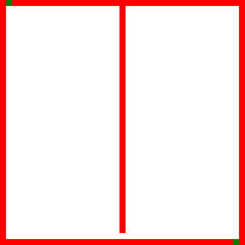

# Maze Solver and Generator
[This website](https://dmaydan.github.io/Maze_Solver_Generator/) generates mazes with recursive divsion and solves them with BFS. The maze and the solution are visualized on the HTML `<canvas>`.

## Recursive Division - Maze Generation
Essentially, at every step, the algorithm bisects the maze horizontally or vertically - then, it chooses a random cell along this bisection to leave open (that way the 2 resulting regions are still connected). Then, the same algorithm is performed on the 2 new regions. Recursion continues until it no longer makes sense to continue bisecting.

Wikipedia GIF:

## Breadth-First Search - Maze Solving
*Breadth-first search (BFS) is an algorithm for traversing or searching tree or graph data structures. It starts at the tree root (or some arbitrary node of a graph, sometimes referred to as a 'search key'[1]), and explores all of the neighbor nodes at the present depth prior to moving on to the nodes at the next depth level.* 
https://en.wikipedia.org/wiki/Breadth-first_search

